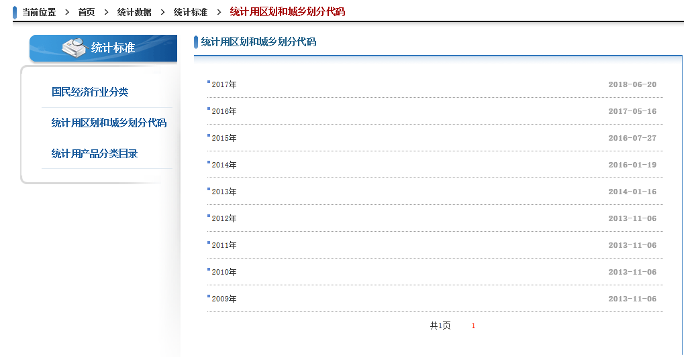
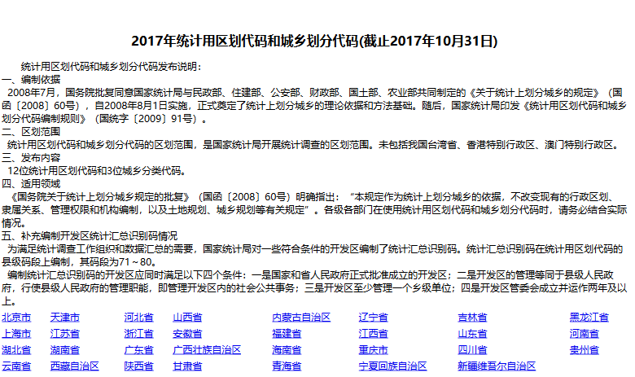
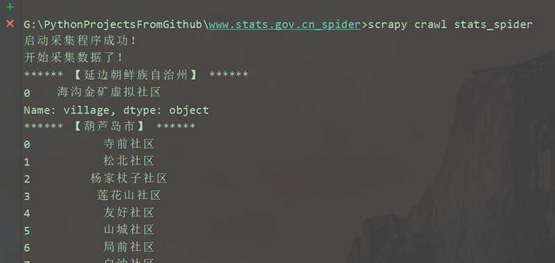

# **<u>国家统计局统计用区划和城乡划分代码 爬虫</u>** 


# 功能概述

本爬虫使用了scrapy框架，功能为采集[国家统计局2009年~2017年统计用区划和城乡划分代码](http://www.stats.gov.cn/tjsj/tjbz/tjyqhdmhcxhfdm/)。

如下图所示：




# 采集的数据维度


| 字段                | 说明             | 示例                                                         |
| ------------------- | ---------------- | ------------------------------------------------------------ |
| year                | 年份             | 2017                                                         |
| prov                | 省份             | 四川省                                                       |
| prov_code           | 省               | 51                                                           |
| city                | 城市             | 成都市                                                       |
| city_code           | 城市代码         | 5101                                                         |
| district            | 区县名           | 武侯区                                                       |
| district_code       | 区县代码         | 510107                                                       |
| town                | 街道名           | 浆洗街街道办事处                                             |
| town_code           | 街道代码         | 510107001                                                    |
| village             | 村/居委会名      | 洗面桥社区居委会                                             |
| village_type        | 村/居委会类型    | 111                                                          |
| village_stats_code  | 村/居委会代码    | 510107001002                                                 |
| city_stats_code     | 城市12位统计代码 | 510100000000                                                 |
| district_stats_code | 区县12位统计代码 | 510107000000                                                 |
| town_stats_code     | 乡镇12位统计代码 | 510107001000                                                 |
| prov_url            | 省份级别解析url  | <http://www.stats.gov.cn/tjsj/tjbz/tjyqhdmhcxhfdm/2017/51.html> |
| city_url            | 城市级别解析url  | <http://www.stats.gov.cn/tjsj/tjbz/tjyqhdmhcxhfdm/2017/51/5101.html> |
| district_url        | 区县级别解析url  | <http://www.stats.gov.cn/tjsj/tjbz/tjyqhdmhcxhfdm/2017/51/01/510104.html> |
| town_url            | 省份级别解析url  | <http://www.stats.gov.cn/tjsj/tjbz/tjyqhdmhcxhfdm/2017/51/01/04/510104020.html> |
| district_tmp_code   | 乡镇临时代码     | 可忽略                                                       |

# 使用方法
## 第一步安装依赖：使用  `pip install -r requirements.txt`安装以下依赖库

```
bs4==0.0.1
fake-useragent==0.1.11
pandas==0.23.4
PyMySQL==0.9.2
Scrapy==1.5.1
SQLAlchemy==1.2.12
Twisted==18.7.0
```

注意：

* `scrapy`中使用到了`Twisted`框架，如果在安装scrapy过程中提示Twisted安装错误：

  可以到

[Twisted]: https://www.lfd.uci.edu/~gohlke/pythonlibs/#twisted

​	下载Twisted 的离线文件安装。

* 若出现 `ImportError: No module named 'win32api'` 错误，下载安装 

  [pywin32]: https://sourceforge.net/projects/pywin32/files/pywin32/


## 第二步：配置基本信息
* 本爬虫默认采集 [国家统计局统计用区县和城乡代码页面](http://www.stats.gov.cn/tjsj/tjbz/tjyqhdmhcxhfdm/)下所有年份的数据，2017年的时候采集了2009~2016年8年间数据，大概是65万左右。

  截止到本月（2018年10月），已经有2009~2017年 共9年的的数据，数据量预计在72万左右，scrapy框架自带多线程，后来又对采集存储的`pipeline`进行了优化，全部采集完预计要6~8个小时。

* 因为数据量较大，所以使用了 mysql 作为存储工具，可在setting里设置，具体设置方法如下：

```
# 配置mysql, 使用sqlalchemy的creteengine
user = "root"  # mysql用户名
passwd = "adas123456"  # mysql用户密码
host = "localhost"  # mysql ip address

db = "mycrawdata"  # 用于设置数据库名，这个必须提前创建好
charset = 'utf8'  # 编码
mysql_settings = "mysql+pymysql://{user}:{passwd}@{host}/{db}?charset={charset}".format(user=user, passwd=passwd,
                                                                                        host=host, db=db,
                                                                                        charset=charset)
engine = create_engine(mysql_settings)

# 设置数据库表名，在这里填写名字即可，若不存在会自动创建
write_sql_table_name = "stats_gov_cn_data"
```

* 默认采集所有年份的数据，如果仅需要采集指定年份的数据，只需要在`setting`里设置`year_settings`为指定年份即可，注意输入数字，不要带引号`""`，如下所示：

  ```python
  year_settings = 2017
  ```

* 其他设置参考 `scrapy`官方文档。

## 第三步：启动采集程序

两种启动方式：

* 在程序根目录，运行`python run.py`


​


​* 在程序根目录，运行`scrapy crawl stats_spider`




## 第四步：在mysql中查看抓取结果

* mysql中查询结果示例


* 导出的excel结果示例


